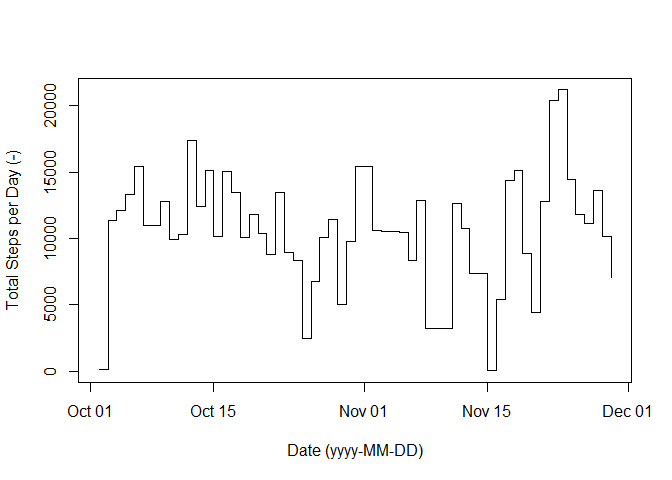
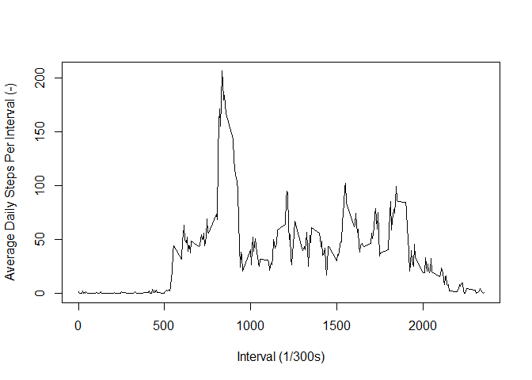
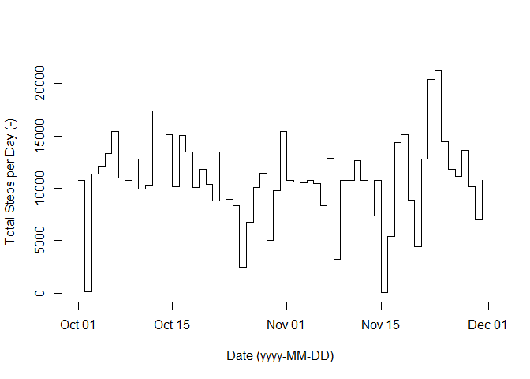
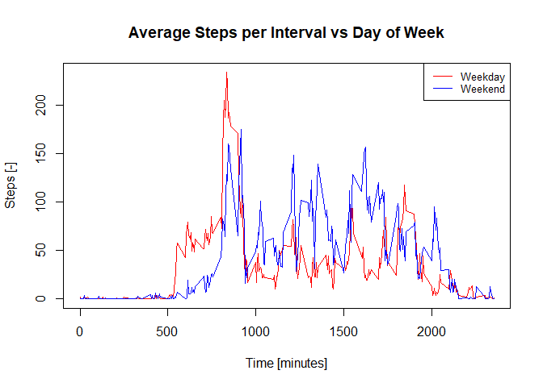

    knitr::opts_chunk$set(echo = TRUE, cache=TRUE)
    library(dplyr)

    ## 
    ## Attaching package: 'dplyr'

    ## The following objects are masked from 'package:stats':
    ## 
    ##     filter, lag

    ## The following objects are masked from 'package:base':
    ## 
    ##     intersect, setdiff, setequal, union

    library(tidyr)

    ## Warning: package 'tidyr' was built under R version 3.6.3

Load and Preprocess Data
------------------------

The data was downloaded from [the course
website](https://d396qusza40orc.cloudfront.net/repdata%2Fdata%2Factivity.zip),
and rows with NA values were omitted.

    activityRaw <- read.csv("activity.csv")

    # Convert date column from factor to date character, in order to plot correctly
    activityRaw$date <- as.Date.character(activityRaw$date)

    # Filter out all NA values
    getNA <- is.na(activityRaw$steps)
    activity <- activityRaw[!getNA, ]

Total, mean, and median steps per day
-------------------------------------

Calculate the total steps per day and plot a histogram of the output

    activityDailySteps <- aggregate(activity$steps, 
                                    by=list(activity$date), 
                                    FUN=sum)

    names(activityDailySteps) <- c("date", "stepsDaily")

    plot(activityDailySteps, 
         type="s", 
         xlab="Date (yyyy-MM-DD)", 
         ylab="Total Steps per Day (-)")

    activityMean <- format(mean(activityDailySteps$stepsDaily), 
                           nsmall=2)

    activityMedian <- format(median(activityDailySteps$stepsDaily), 
                             nsmall=2)

There were an average of 10766.19 steps per day, with a median of 10765.

Average daily activity pattern
------------------------------

The average daily step activity is shown below:

    activityPatternMean <- aggregate(activity$steps, 
                                     FUN=mean, 
                                     by=list(activity$interval))

    names(activityPatternMean) <- c("interval", "stepsMean")

    plot(activityPatternMean, type="l", 
         xlab="Interval (1/300s)", 
         ylab="Average Daily Steps Per Interval (-)")

    max <- format(max(activityPatternMean$stepsMean), 
                  digits=5)

    indexMax <- which.max(activityPatternMean$stepsMean)

    intervalMaxSteps <- activityPatternMean[indexMax,]$interval

The maximum of the mean steps per interval, 206.17, occurred during
interval number 835.

Impact of missing values
------------------------

This section seeks to express the impact that these missing values can
have on the analysis.

    activityNA <- activityRaw[getNA, ]
    countNA <- dim(activityNA)[1]

There were 2304 NA values within the raw data.

The table was rebuilt including the NA step rows, and the NA steps were
replaced with the average steps for each interval

    # Set each NA steps value to the mean for each interval 
    for (row in 1:countNA){
        interval <- activityNA$interval[row] # get the interval value for the NA row
        # get the mean interval step value and replace the NA value with it
        activityNA$steps[row] <- 
            activityPatternMean[activityPatternMean$interval==interval,]$stepsMean
    }
    activityAll <- rbind(activityNA, 
                         activity)

The daily total steps were recalculated with the replaced NA values and
the results are displayed below.

    activityAll <- aggregate(activityAll$steps, 
                             by=list(activityAll$date),
                             FUN=sum)

    names(activityAll) <- c("date", "stepsDaily")

    plot(activityAll, 
         type="s", 
         xlab="Date (yyyy-MM-DD)", 
         ylab="Total Steps per Day (-)")

As can be seen in the above graph, the values for total daily steps have
changed for some days but most stay the same.

    activityMeanNA <- format(mean(activityAll$stepsDaily), nsmall=2)
    activityMedianNA <- format(median(activityAll$stepsDaily), nsmall=2)

The mean daily steps has changed from 10766.19 to 10766.19, and the
median daily steps has changed from 10765 to 10766.19. Note that because
the missing data was replaced with the interval mean, the mean value did
not change at all. This shows that the impact of inputting missing data
has a small effect on the estimates for total daily number of steps.

### Activity patterns between weekdays and weekends

The data was divided into weekday and weekend factors, and the mean
steps per interval calculated for each factor.

    activityWeekdays <- mutate(activity, 
                               dayOfWeek = factor(
                                   substring(weekdays(as.Date(date)),1,1) == "S",
                                   labels=c("weekday","weekend")
                                   ) 
                               )

    activityWeekdaysMean <- setNames(aggregate(activityWeekdays$steps,
                                               by=list(activityWeekdays$dayOfWeek,
                                                       activityWeekdays$interval),
                                               FUN=mean)
                                     ,c("dayOfWeek","interval","steps"))

    plot(activityWeekdaysMean[activityWeekdaysMean$dayOfWeek == "weekday",]$interval,
         activityWeekdaysMean[activityWeekdaysMean$dayOfWeek == "weekday",]$steps,
         type="l",col="red",
         xlab="Time [minutes]",
         ylab="Steps [-]",
         main="Average Steps per Interval vs Day of Week")

    lines(activityWeekdaysMean[activityWeekdaysMean$dayOfWeek == "weekend",]$interval,
          activityWeekdaysMean[activityWeekdaysMean$dayOfWeek == "weekend",]$steps,
          type="l",col="blue")

    legend("topright",
           legend=c("Weekday","Weekend"),
           col=c("red","blue"), lty=1, cex=0.8)

The plot shows that the average weekday steps are higher than weekend
steps before approximately 900 minutes and generally lower afterwards.
